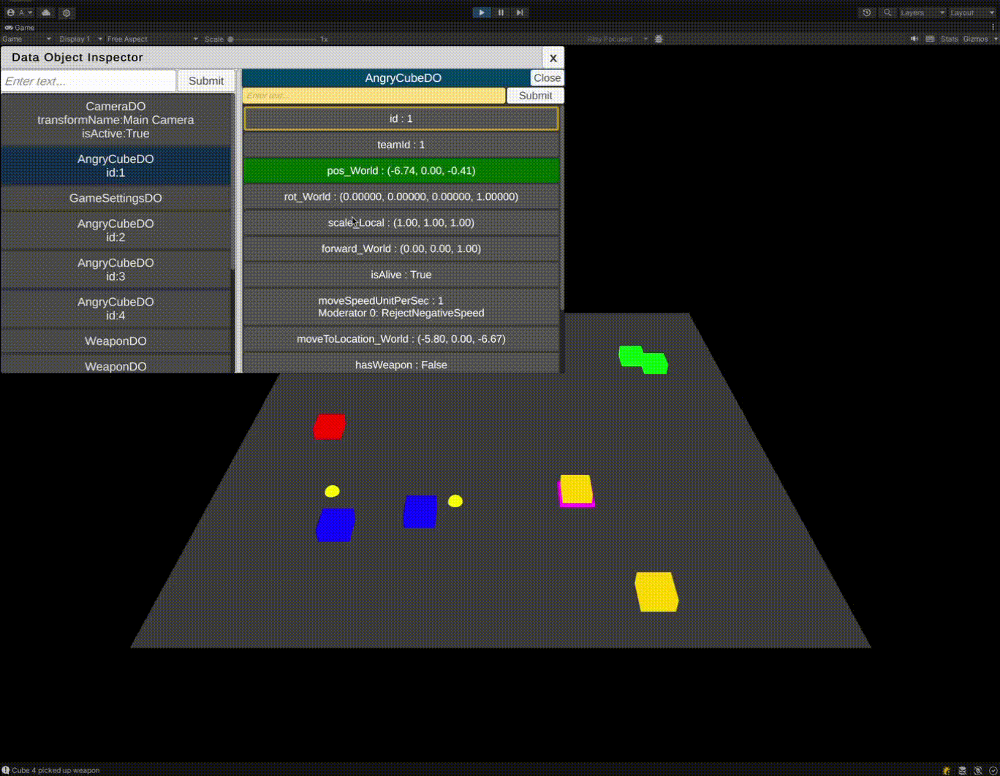

# CoreDev — A Reactive Game Framework for Unity

**CoreDev** is a lightweight, modular framework that cleanly separates **data**, **logic**, and **presentation** using reactive programming patterns. It enables Unity developers to build scalable gameplay systems where UI, behavior, and game state stay synchronized — automatically and transparently.

---

## 🚀 Key Features

- 🔄 Fully reactive variable binding — no polling or glue code
- 🧱 Clean separation of concerns between data, logic, and visuals
- 🧠 Inversion-of-control for clean, testable behaviors
- ⚙️ Data-driven instantiation of GameObjects
- 🔍 Built-in runtime inspector to monitor and debug data and bindings live
- 🧪 Easily test components in isolation with mock `DataObjects`

---

## 🧠 Architecture Overview

CoreDev centers around a **data-push model**:
- `DataObjects` store game entity state via `ObservableVars`
- `Spawnees` (logic or visual components) **react to changes** in those variables
- `Spawners` instantiate prefabs when new `DataObjects` are created
- `DataObjects` traverse GameObject hierarchies to offer themselves to `Spawnees`, which choose whether to bind

This approach enforces **decoupling** and makes systems more modular, testable, and easy to debug.

---

## 🔍 Runtime Inspector Tool

CoreDev comes with a powerful in-game GUI for development and debugging:

- ✅ View all active `DataObjects`
- 📈 Inspect live `ObservableVar` values
- 🔗 See which `Spawnees` are subscribed to which variables
- 🔧 Change values live and observe updates in real time

> This visibility drastically improves iteration speed and confidence during development.



---

## 📦 Installation

1. Clone the repository:
   ```bash
   git clone https://github.com/EbilCat/CoreDev.git
   ```

2. Move the folder into your Unity project:
   ```
   Assets/Plugins/CoreDev/
   ```

That’s it! You’re ready to start using reactive data flows in your game.

---

## 🔧 Core Components

### 🧮 ObservableVar<T>
`ObservableVar<T>` holds a value and notifies listeners when it changes. You can use built-in types like `OInt`, `OFloat`, and `OString`.

```csharp
playerDO.Health.Value = 50; // Triggers all registered callbacks
```

### 📆 DataObject
Encapsulates the state of a game entity using `ObservableVars`.

```csharp
public class PlayerDO : IDataObject
{
    public readonly OString Name = new("Geralt");
    public readonly OInt Health = new(100);
}
```

It can push itself to a GameObject hierarchy:

```csharp
playerDO.BindAspect(this.gameObject);
```

### 🧠 Spawnee
A component that reacts to a `DataObject`. It may update UI, control logic, or handle effects.

```csharp
public override void BindDO(IDataObject dataObject)
{
    AttemptDependencyBind(dataObject, ref playerDO);
}
```

### 🧬 Spawner
Watches for new `DataObjects` and spawns corresponding GameObjects.

```csharp    
    public class PlayerAvatarSpawner : BaseSpawner<PlayerDO, PlayerAvatar>
    {
        protected override bool ShouldProcessDataObject(PlayerDO dataObject)
        {
            bool shouldProcess = (dataObject.teamId.Value == this.teamId);
            return shouldProcess;
        }

        protected override PlayerAvatar InstantiatePrefab(PlayerDO dataObject)
        {
            PlayerAvatar prefabInstance = Instantiate(this.prefab);
            return prefabInstance;
        }

        protected override void DisposePrefabInstance(PlayerAvatar prefabInstance)
        {
            Destroy(prefabInstance.gameObject);
        }
    }
```

---

## 🔗 Data Flow & Binding

CoreDev uses **inversion of control**:  
`DataObjects` push themselves to GameObject hierarchies via `BindAspect`.  
Each `Spawnee` then decides whether to keep a reference and bind to the data.

Spawnees can optionally retrieve shared/global data from the `DataObjectMasterRepository`, but this is best reserved for non-local data (e.g. game-wide state).

> ❗ If a `Spawnee` requires a dependency and none is provided, a clear warning is logged at runtime.

---

## 📐 Design Patterns Used

| Pattern                        | Role in CoreDev                                           |
|-------------------------------|------------------------------------------------------------|
| **Observer**                  | `ObservableVar` notifies listeners on change              |
| **MVVM (Unity-style)**        | `DataObject` = model, `Spawnee` = view/logic              |
| **Factory**                   | `Spawner` instantiates GameObjects from data              |
| **Dependency Inversion**      | Data offers itself; Spawnees opt-in                       |
| **Service Locator (optional)**| `DataObjectMasterRepository` for global/fallback access   |

---

## ✅ Strengths

- ⚡ Fast iteration with reactive updates and live debugging
- 🧼 Cleaner, less tangled gameplay code
- 🔍 Runtime introspection helps track down bugs quickly
- 🔁 Easy to test components in isolation
- 🔗 Encourages loosely coupled systems

---

## ⚠️ Trade-offs & Recommendations

| Limitation                             | Recommendation                                           |
|----------------------------------------|----------------------------------------------------------|
| Dependencies resolved at runtime       | Logs + inspector help catch issues early                 |
| No compile-time validation             | Optional: create Unity editor tools for static analysis  |
| Testing requires setup                 | Use mock `DataObjects` or inject directly                |
| Global access can lead to coupling     | Use Master Repository only for shared/game-wide state    |

---

## 🧪 Examples

### Health Bar Spawnee

```csharp
public class HealthBarController : BaseSpawnee
{
    private PlayerDO playerDO;
    private HealthBar healthBar;

    public override void BindDO(IDataObject dataObject)
    {
        AttemptDependencyBind(dataObject, ref playerDO);
    }

    protected override bool FulfillDependencies() =>
        this.playerDO != null;

    protected override void RegisterCallbacks()
    {
        this.playerDO.Health.RegisterForChanges(OnHealthChanged);
    }

    private void OnHealthChanged(ObservableVar<int> var)
    {
        this.healthBar.Set(var.Value);
    }
}
```

### Player DataObject

```csharp
public class PlayerDO : IDataObject
{
    public readonly OString Name = new("Geralt");
    public readonly OInt Health = new(100);
}
```

---

## 🎯 Use Cases

CoreDev is ideal for:

- Games with reactive UI, health bars, HUDs, etc.
- Modular enemy and NPC logic tied to shared data
- Sandbox and simulation-style projects
- Developers seeking a **data-driven architecture** without Unity DOTS complexity

---

## 📜 License

MIT License — free to use and modify in commercial or personal projects.

---

## 💬 Feedback & Contributions

CoreDev is actively used and maintained.  
If you have suggestions or find bugs, open an [issue](https://github.com/EbilCat/CoreDev/issues) or submit a pull request!

---

## 📜 License

This project is licensed under the **MIT License with Attribution**.

You are free to use, modify, and distribute this software for personal or commercial purposes, but **credit must be given** to the original author:

**David Ho (EbilCat)**

See the full [LICENSE](./LICENSE) file for details.
